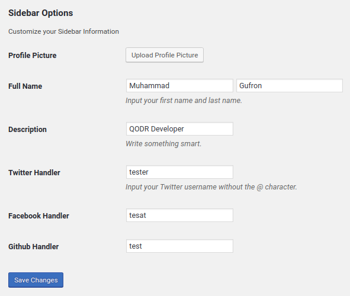
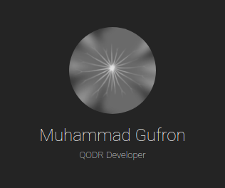

# Sunset Documentation

## Option menu

### 1. Sidebar

To select General menu goto admin panel choose `Sunset > General`

  

`Upload Profile Picture` upload a foto for Profile picture,  
`Full name` user input first name and last name,  
`Description` is a text for user sidebar description,  
`Twitter Handler` User only input username twitter,  
`Facebook Handler` user input URL facebook,  
`Github Handler` input the URL github

After done your input then click `Save Changes`  

The preview from is in left side of from input form,  

  


### 2. Custom CSS

```html
"This sentence is surrounded by &quot; and &quot;, which are a type of quotation marks."

“This sentence is surrounded by &ldquo; and &rdquo;, which are a type of quotation marks.”

‘This sentence is surrounded by &lsquo; and &rsquo;, which are a type of quotation marks.’

«This sentence is surrounded by &laquo; and &raquo;, which are a type of quotation marks.»

‹This sentence is surrounded by &lsaquo; and &rsaquo;, which are a type of quotation marks.›

„This sentence is surrounded by &bdquo; and &ldquo;, which are a type of quotation marks.“

‚This sentence is surrounded by &sbquo; and &lsquo;, which are a type of quotation marks.‘
```
